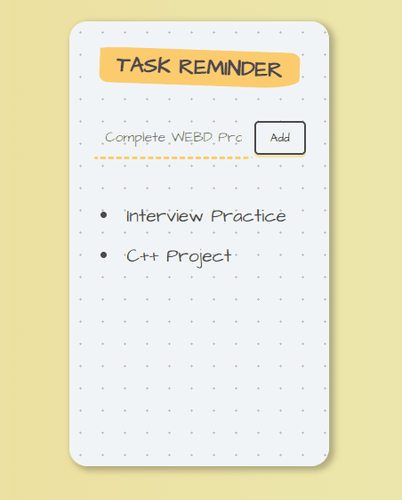

# Task Reminder 💪

## My Goal

The objective of this project is to creat an app that add new items and add just by click our own beautiful user interface designs. If you have a designer on board, no matter how unconventional their designs are, we can create them using Flutter. 

## What I have learnt from this project

- How to use Flutter themes to create coherent branding. 
- How to create multi-page apps using Flutter Routes and Navigator.
- How to extract and refactor Flutter Widgets with a click of the button. 
- How to pass functions as parameters and fields.
- How to use the GestureDetector Widget to detect more than just a tap.
- How to use custom colour palettes by using hex codes.
- How to customise Flutter Widgets to achieve a specific design style.
- Understand Dart Enums and the Ternary Operator.
- Learn about composition vs. inheritance and the Flutter way of creating custom UI.
- Understand the difference between const and final in Dart and when to use each.
